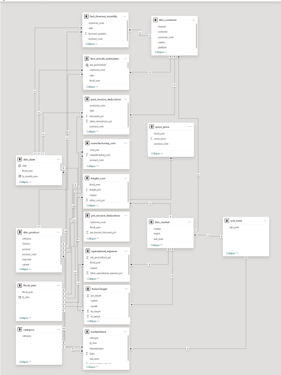
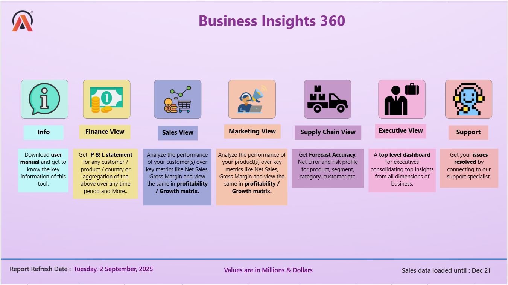
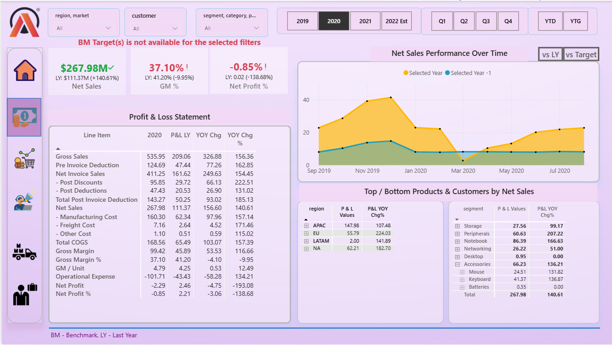
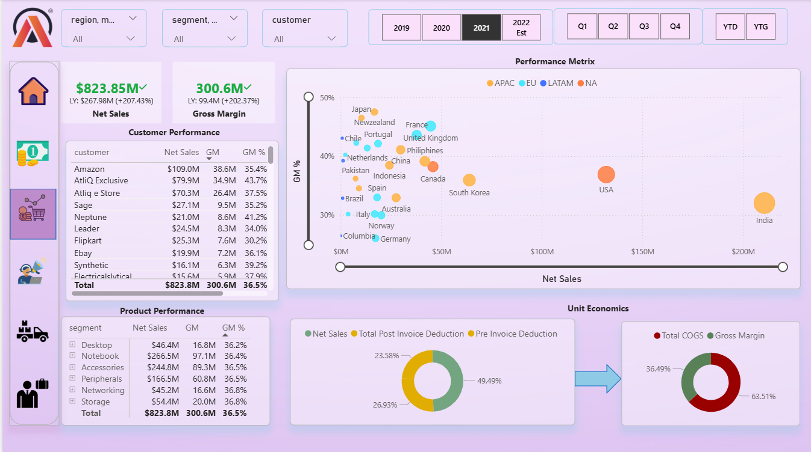
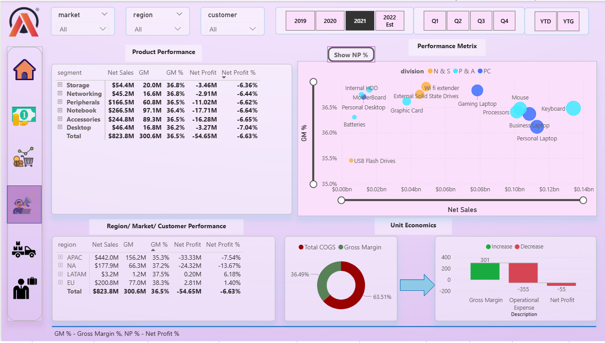
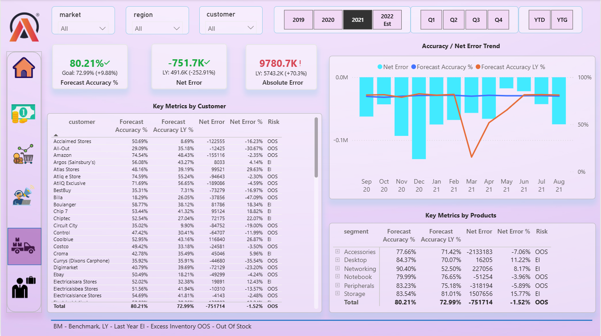
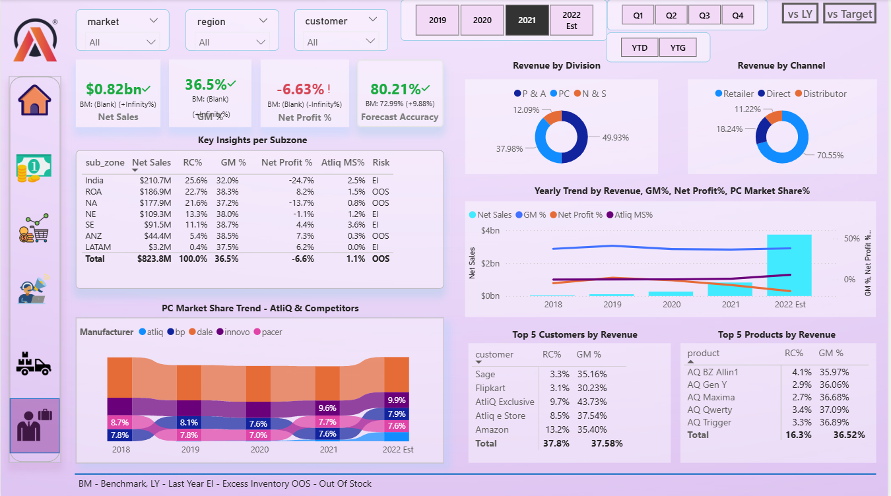

# Business Insights 360 – Power BI Project 

_An urgent need for a dedicated analytics system to reduce guesswork and improve business decisions._

**Live Dashboard:** [Click here](https://app.powerbi.com/view?r=eyJrIjoiYjQxMjk5NzEtNzBlNi00ZWY4LTk1MTItYmE5NDU1MmY0ZGY1IiwidCI6ImM2ZTU0OWIzLTVmNDUtNDAzMi1hYWU5LWQ0MjQ0ZGM1YjJjNCJ9)

---

## 📌 Table of Contents
- <a href="#overview">Overview</a>
- <a href="#business-problem">Business Problem</a>
- <a href="#dataset">Dataset</a>
- <a href="#tools--technologies">Tools & Technologies</a>
- <a href="#powerbi-features">Power BI Features</a>
- <a href="#data-model">Data Model</a>
- <a href="#dashboard">Dashboard</a>
- <a href="#final-recommendations">Final Recommendations</a>
- <a href="#author--contact">Author & Contact</a>

---
<h2>Overview</h2>

Recently AtliQ Hardware faced losses from a poorly planned store expansion in the USA, which was based only on surveys and Excel analysis. This highlighted the urgent need for a dedicated analytics system to reduce guesswork and improve business decisions.  

---
<h2>Business Problem</h2>

AtliQ Hardware has been growing rapidly and expanding into global markets. To keep up with competitors who already rely on advanced analytics, the company decided to leverage **Power BI** for making data-driven decisions.  

This project, part of the **Codebasics Bootcamp**, focuses on building an **interactive dashboard** that answers key stakeholder questions across:  
- Finance  
- Sales  
- Marketing  
- Supply Chain  
- Executive  
- Product 

---
<h2>Dataset</h2>

The project uses two databases provided in the Bootcamp: **gdb041** and **gdb056**.  
Together, they cover customers, products, markets, sales, forecasts, and associated costs.  

---

### 🗄️ gdb041  

- **fact_sales_monthly**  
  - Monthly actual sales quantities  
  - Helps track performance against forecast 
  
- **fact_forecast_monthly**  
  - Monthly demand forecasts by customer  
  - Used to compare forecast vs. actual sales for inventory planning  
  
- **dim_customer**  
  - 27 markets (e.g., India, USA, Spain)  
  - 75 unique customers  
  - Platforms: *Brick & Mortar* (offline), *E-commerce* (Amazon, Flipkart, etc.)  
  - Channels: Retailer, Direct, Distributor  

- **dim_market**  
  - Market details grouped into **7 sub-zones** and **4 regions** (APAC, EU, NAN, LATAM)  

- **dim_product**  
  - 3 Divisions: P&A (Peripherals & Accessories), PC (Notebooks & Desktops), N&S (Networking & Storage)
  - 6 Segments: Accessories, Desktops, Networking, Notebooks, Peripherals, Storage.  
  - 14 Product Categories (e.g., Batteries, Business Laptop, Internal HDD, Keyboard) with multiple variants 
  - 73 Products: (e.g.: AQ Aspiron, AQ Clx1, AQ Lite, AQ Maxima etc.)
  - 27 Varients: e.g.: Plus, Plus1, Premium, Standard etc.  

---

### 🗄️ gdb056  

- **freight_cost** 
	– Logistics and freight expenses by market & fiscal year  
	
- **gross_price** 
	– Gross product prices by product code & fiscal year 
	
- **manufacturing_cost** 
	– Manufacturing costs by product code & fiscal year 
	
- **pre_invoice_deductions** 
	– Trade discounts applied before invoicing (customer & year level) 
	
- **post_invoice_deductions** 
	– Discounts and claims applied after invoicing by customer, product & year 

---

<h2>Tools & Technologies</h2>

- SQL  
- Power BI Desktop  
- Excel  
- DAX  
- DAX Studio 
- GitHub

---

<h2>Power BI Features</h2>
 
- Data cleaning and transformations with **Power Query**  
- **Galaxy data modeling** for efficient relationships  
- Creating **measures and KPIs** using DAX  
- **Dynamic titles** that respond to applied filters  
- **Conditional formatting** with icons and colors  
- **Bookmarks & navigation buttons** for smooth report flow  
- **Drill-through** and **tooltips** for detailed insights  
- **Date table creation** using M language  
- **KPI indicators** for quick performance checks  
- **Data validation techniques** to ensure accuracy  

---

<h2><a class="anchor" id="data-model">Data Model</a></h2>

The dashboard is powered by a well-structured Galaxy schema for efficient querying and optimized performance.  

<h2>Dashboard</h2>

- Power BI Dashboard shows:
  - Home View : Navigate seamlessly with a central landing page  
  - Finance View : Analyze P&L statements, Net Sales trends, and top/bottom customers & products 
  - Sales View – Explore customer and product performance with Net Sales, Gross Margin %, unit economics, and deductions  
  - Marketing View – Gain insights by market, region, product, and customer, tracking GM% and NP% across segments  
  - Supply Chain View – Track Forecast Accuracy, Net Error, and Absolute Error with trend analysis for optimization  
  - Executive View – Monitor Market Share Trend & Yearly Trend by Revenue, GM%, Net Profit%, PC Market Share%.   
  
---
<h2>Home Page</h2>
Central navigation hub with buttons to access each domain view.  

<<<<<<< HEAD

=======

>>>>>>> 15eaaa267e602e8ffdb598a6ffb73cd6368b57e1

---

<h2>Finance View</h2>
Analyze Profit & Loss statements, Net Sales trends, and top/bottom customers & products.  

<<<<<<< HEAD

=======

>>>>>>> 15eaaa267e602e8ffdb598a6ffb73cd6368b57e1

---

<h2>Sales View</h2>
Customer and product performance with insights into Net Sales, Gross Margin %, and unit economics.  

<<<<<<< HEAD

=======

>>>>>>> 15eaaa267e602e8ffdb598a6ffb73cd6368b57e1

---

<h2>Marketing View</h2>
Market, region, product, and customer insights while tracking GM% and NP% across segments.  

<<<<<<< HEAD

=======

>>>>>>> 15eaaa267e602e8ffdb598a6ffb73cd6368b57e1

---

<h2>Supply Chain View</h2>
Track Forecast Accuracy, Net Error, and Absolute Error with trend analysis for supply chain optimization.  

<<<<<<< HEAD

=======

>>>>>>> 15eaaa267e602e8ffdb598a6ffb73cd6368b57e1

---

<h2>Executive View</h2>
High-level performance overview including revenue by division, customers, products, and channels.  

<<<<<<< HEAD

=======

>>>>>>> 15eaaa267e602e8ffdb598a6ffb73cd6368b57e1

---

<h2>Project Outcomes</h2>

This project demonstrates how **1.9M+ rows of raw data** were transformed into an **interactive, decision-focused dashboard**.  

It enables:  
- **Finance Teams** → Monitor profitability and sales performance  
- **Sales & Marketing Teams** → Identify key customers, products, and markets  
- **Supply Chain Teams** → Track forecast accuracy and optimize planning  
- **Executives** → Make smarter and faster decisions with confidence 

---
<h2>Author & Contact</h2>

**Rita Mahato**  
Aspiring Data Analyst  
📧 Email: ritamahato.analytics@gmail.com  
🔗 [LinkedIn](https://www.linkedin.com/in/mahato-rita/)  
# report-finance-sales-marketing-supplychain-executive-excel-sql-powerbi
